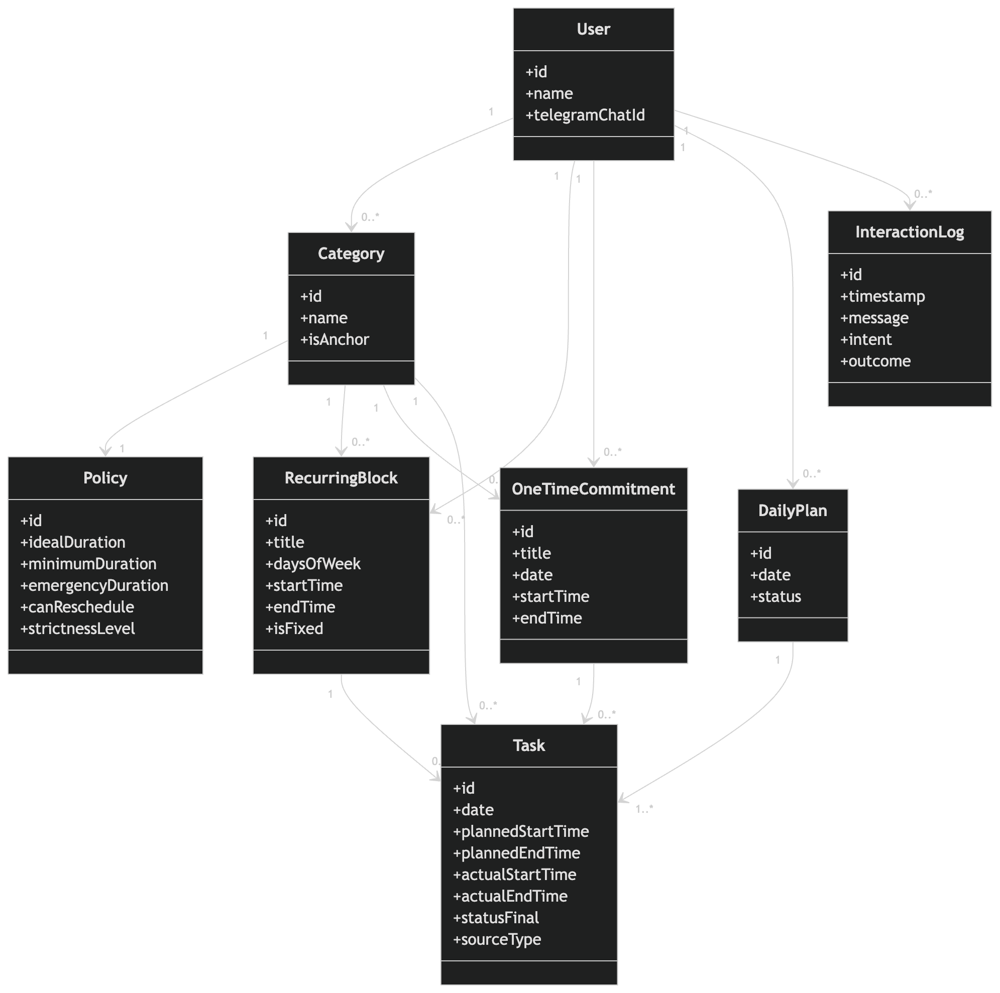

# Objetivo

Maximizar tua constância semanal nas categorias principais da tua rotina, com:

cobrança firme
remanejamento inteligente
proteção do sono
memória do teu comportamento
adaptação progressiva

O que ele é: Um operador da tua rotina.

O que ele não é:
terapeuta
amigo motivacional
chatbot aberto que conversa sobre qualquer coisa
planner perfeito que exige dias perfeitos
agente “mágico” que adivinha teu estado o tempo todo

# Problema

O problema não é falta de intenção.
É o intervalo entre:

saber o que deve ser feito
executar mesmo sem vontade
remanejar sem se enganar
não deixar um atraso virar desistência

Então o produto existe para resolver:

procrastinação por atrito
negociação interna demais
adiamento vago
quebra de sequência
decisões ruins de curto prazo que sabotam a semana

# Solução 

**Filosofia fixa do co-piloto:**

tom firme, direto e respeitoso
nunca aceitar adiamento vago
sempre oferecer opções fechadas
proteger o sono
priorizar constância sobre conforto imediato
tarefa não some; muda de forma

# Software Requirements

## Functional Requirements

FR01. O sistema deve permitir o cadastro de múltiplos usuários.

FR02. O sistema deve permitir que cada usuário cadastre suas próprias categorias de rotina.

FR03. O sistema deve permitir que cada usuário cadastre blocos recorrentes, incluindo dias da semana, horários e categoria associada.

FR04. O sistema deve permitir que cada usuário cadastre compromissos pontuais em datas e horários específicos.

FR05. O sistema deve permitir que cada usuário configure políticas por categoria ou bloco, incluindo duração ideal, mínima e emergencial.

FR06. O sistema deve permitir que o usuário defina atividades ou blocos como âncoras da rotina.

FR07. O sistema deve gerar automaticamente a visão diária de cada usuário com base em blocos recorrentes, compromissos pontuais, pendências e ajustes realizados.

FR08. O sistema deve enviar uma mensagem no início de cada tarefa ou bloco planejado.

FR09. O sistema deve apresentar, na mensagem da tarefa ou bloco, opções de manejo como iniciar, reduzir duração, adiar com horário definido ou concluir.

FR10. O sistema deve permitir que o usuário informe conflitos, imprevistos ou mudanças que afetem sua rotina.

FR11. O sistema deve recalcular ou sugerir remanejamento de tarefas ou blocos quando houver conflito, considerando as regras configuradas do usuário.

FR12. O sistema deve permitir alterar apenas uma ocorrência específica de um bloco recorrente sem modificar a recorrência base.

FR13. O sistema deve permitir alterar permanentemente um bloco recorrente quando o usuário indicar uma mudança estrutural em sua rotina.

FR14. O sistema deve registrar o status final de cada tarefa ou bloco diário, incluindo feito, feito mínimo, feito emergencial, adiado ou não realizado.

FR15. O sistema deve armazenar o histórico de interações, tarefas, blocos e resultados de cada usuário separadamente.

FR16. O sistema deve gerar um fechamento diário com o resumo das atividades realizadas, pendentes e remanejadas.

FR17. O sistema deve interpretar mensagens livres do usuário para identificar intenções como adiamento, conflito de agenda, conclusão, exceção pontual ou mudança permanente.

FR18. O sistema deve solicitar esclarecimentos ao usuário quando houver ambiguidade relevante que impeça a interpretação segura de uma configuração ou alteração de rotina.

FR19. O sistema deve associar cada usuário ao seu respectivo canal de comunicação no Telegram.

FR20. O sistema deve respeitar as restrições de sono do usuário ao sugerir reduções ou remanejamentos de tarefas.

FR21. O sistema deve considerar a prioridade das âncoras ao sugerir reorganizações da rotina.

## Non-functional Requirements

**Qualidade de serviço**

NFR01. O sistema deve suportar múltiplos usuários com isolamento de dados entre eles.

NFR02. As mensagens programadas devem ser enviadas com atraso máximo de X segundos em relação ao horário planejado.

NFR03. O sistema deve persistir os dados de usuários, blocos, tarefas e histórico de forma confiável, evitando perda de registros em caso de reinício da aplicação.

NFR04. O sistema deve manter o estilo do copiloto fixo e consistente para todos os usuários.

NFR05. O sistema deve manter consistência entre blocos recorrentes, compromissos pontuais, exceções diárias e alterações permanentes.

**Segurança e integridade**

NFR06. O sistema deve garantir que um usuário não possa acessar dados de outro usuário.

NFR07. O sistema deve validar entradas recebidas do Telegram e das integrações externas antes de processá-las.

NFR08. O sistema deve evitar suposições em situações ambíguas que possam comprometer a integridade da rotina do usuário.

**Restrições tecnológicas**

NFR09. O backend deve ser implementado com FastAPI.

NFR10. O banco de dados deve ser PostgreSQL.

NFR11. O canal de comunicação da V1 deve ser Telegram Bot.

NFR12. Os agendamentos da V1 devem ser implementados com APScheduler.

NFR13. A OpenAI API deve ser utilizada apenas para parsing de mensagens e verbalização de respostas, com structured outputs e/ou function calling.

NFR14. As decisões centrais de agenda, recorrência, exceção e remanejamento devem seguir regras de negócio implementadas no sistema, não dependendo exclusivamente da IA.

# Domain UML Class Diagram

- User: a pessoa que usa o copiloto.
- Category: tipo/agrupamento da atividade. Ex.: Sono, Treino, Alimentação, Aula, Leitura.
- isAnchor: marca categorias tratadas com mais rigor pelo sistema.
- Policy: define como aquela categoria deve ser tratada.
- RecurringBlock: algo recorrente na rotina.
- OneTimeCommitment: algo pontual, com data específica.
- DailyPlan: a visão do dia.
- Task: a ocorrência concreta que entra naquele dia e recebe o status final.
- InteractionLog: histórico das interações relevantes com o copiloto.

Tem 3 pontos que eu deixaria em mente:

- Task nasce de uma origem ou de um RecurringBlock ou de um OneTimeCommitment
- Category continua existindo, mas não é o centro de tudo. Ela organiza e classifica. A agenda real vem dos blocos e compromissos.
- Âncora não virou classe virou propriedade de Category e isso ficou bem mais limpo pra V1

# MER

# Modelo lógico relacional
