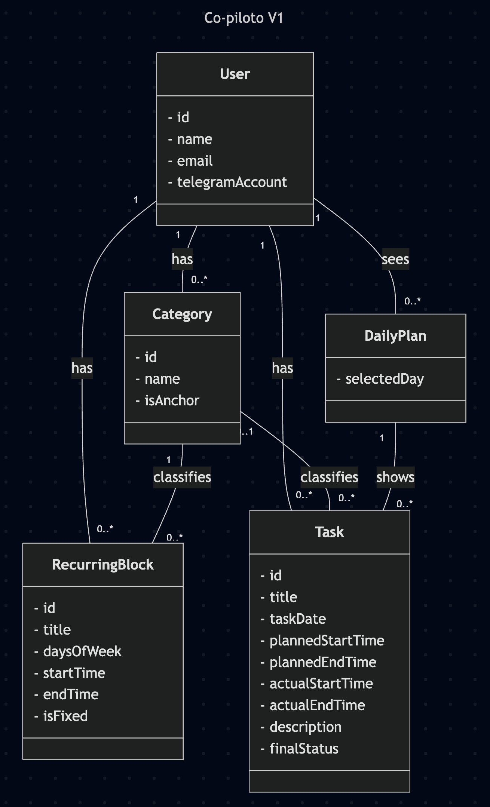
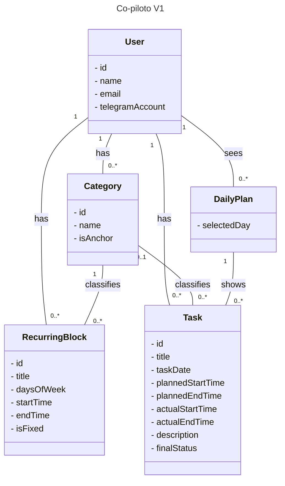
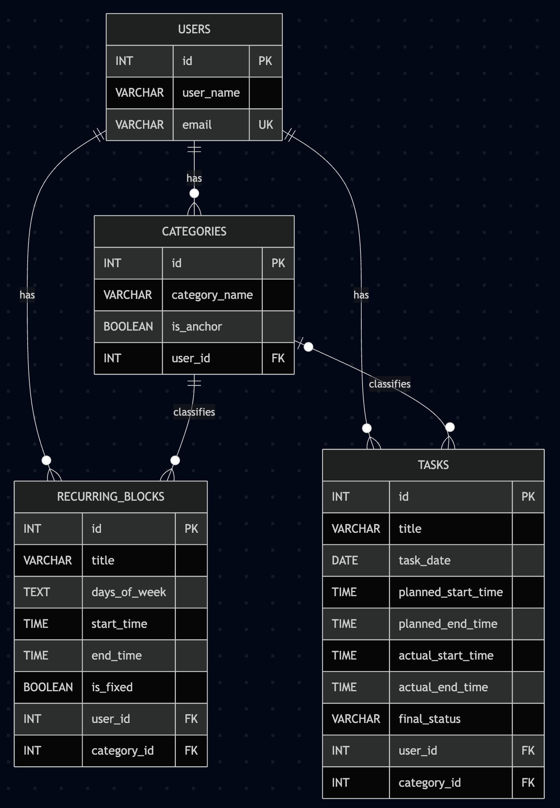
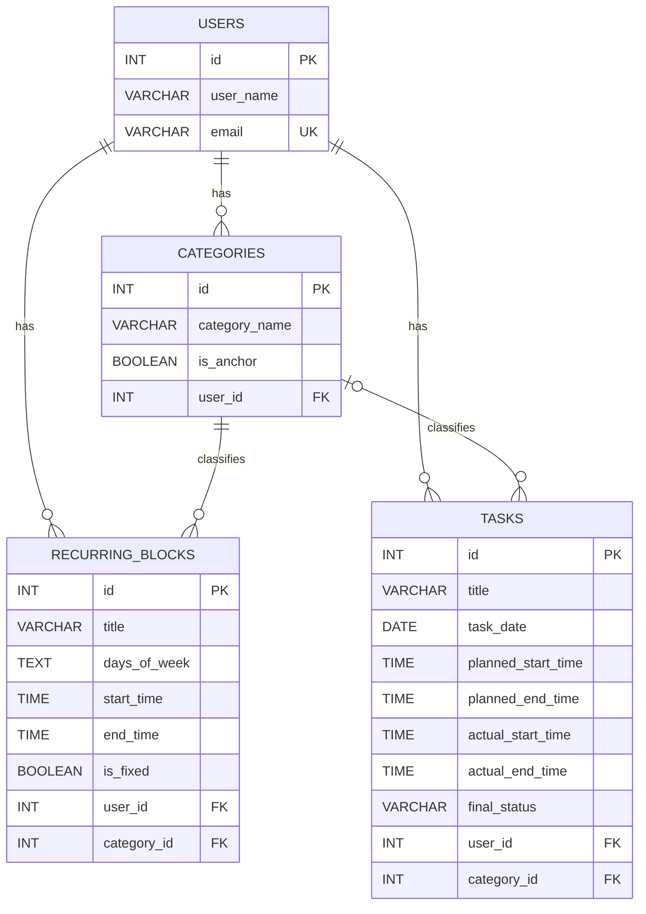

# Versão 1

## Software Requirements

### Functional Requirements

FR01. O sistema deve permitir o cadastro e gerenciamento de um usuário principal.

FR02. O sistema deve permitir o cadastro de categorias.

FR03. O sistema deve permitir que categorias sejam marcadas como âncoras da rotina.

FR04. O sistema deve permitir o cadastro de blocos recorrentes, incluindo dias da semana, horários e categoria associada.

FR05. O sistema deve permitir o cadastro de tasks independentes de blocos recorrentes.

FR06. O sistema deve permitir que uma task tenha categoria associada de forma opcional.

FR07. O sistema deve armazenar categorias, blocos recorrentes e tasks do usuário.

FR08. O sistema deve permitir a consulta das categorias cadastradas.

FR09. O sistema deve permitir a consulta dos blocos recorrentes cadastrados.

FR10. O sistema deve permitir a consulta das tasks cadastradas.

FR11. O sistema deve registrar o status final de cada task.

FR12. O sistema deve gerar uma visão diária simples com base nos blocos recorrentes e nas tasks cadastradas para uma data.

FR13. O sistema deve associar o usuário ao seu canal de comunicação no Telegram.

### Non-functional Requirements

**Qualidade de serviço**

NFR01. O sistema deve persistir os dados de categorias, blocos recorrentes e tasks de forma confiável, evitando perda de registros em caso de reinício da aplicação.

NFR02. O sistema deve manter o estilo do copiloto fixo e consistente.

**Segurança e integridade**

NFR03. O sistema deve validar os dados recebidos antes de persisti-los no banco.

**Restrições tecnológicas**

NFR04. O backend deve ser implementado com FastAPI.

NFR05. O banco de dados deve ser PostgreSQL.

NFR06. O canal de comunicação da V1 deve ser Telegram Bot.

NFR07. Caso a OpenAI API seja utilizada na V1, ela deve ser usada apenas para parsing de mensagens e verbalização de respostas.

NFR08. As regras centrais de cadastro, vínculo entre entidades e geração da visão diária devem ser implementadas no sistema, sem depender exclusivamente da IA.

## Domain UML Class Diagram

## Modelo lógico relacional

